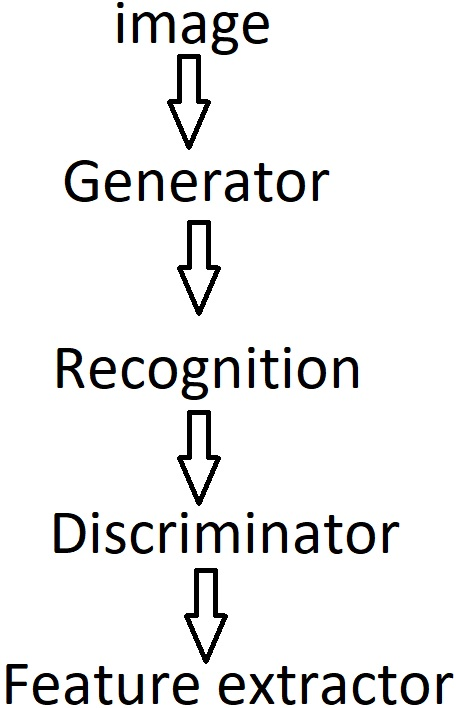

# Superresolution-Recognition
I am combining esrgan and crnn to recognize objects with different approach. It is just an experiment.
Basically combining i am summing up esrgan generator loss and recognition loss. 
In this way i am tring to optimize both different architectures at one time.

## Dataset
I am using bunch of different datasets, however my main test dataset is the UFPR-ALPR dataset.
  

link: http://www.inf.ufpr.br/vri/databases/UFPR-ALPR.zip
  

## Implementation Details

- It is just a prototype!
- You should know that dataset class first load all dataset in to ram and starts the process. UFPR-ALPR dataset is a big one and memorizing takes very long time. 
read -> transform -> assign to preallocated array as an improvement.
- Takes very long time to complete.
- [ESRGAN](https://arxiv.org/abs/1809.00219): it has 3 networks.
- Ocr model has a attention and ctc loss based architecture. it has 1 networks.. Output channels order have to change.
- There is 4 different networks have to be trained.
- I don't have resources to continue optimization process much longer. This models are pretty heavy for any king of desktop.

- The main deep learning framework in this repository is Pytorch
- !!! There is not going to frequently update !!!
- I do not provide any support or assistance for the supplied code nor we offer any other compilation/variant of it.
- I assume no responsibility regarding the provided code.